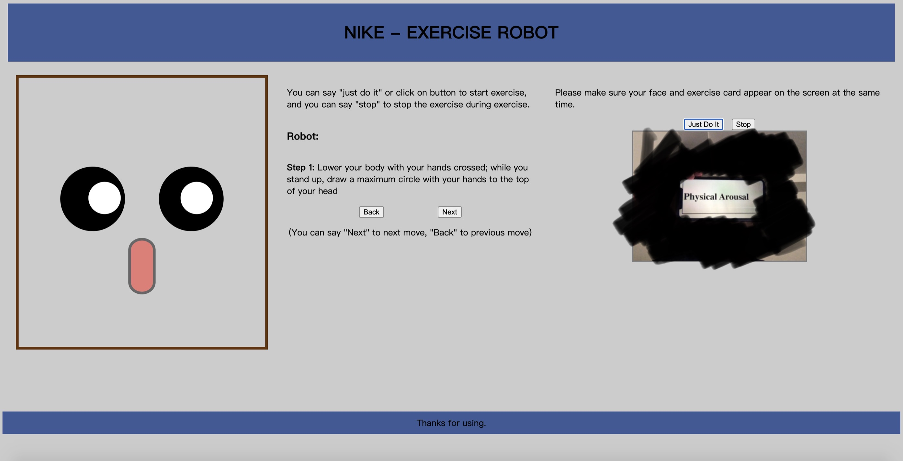

# Simple-web-sport-robot-with-face-recognition-and-voice-recognition
This is a simple web application, it uses face recognition, word recognition and voice recognition to build a virtual robot to assist the user to do exercise.

## Features
- Determine when a person is in front of the robot.
- The robot walks the user through steps of an exercise routine, verbally explaining the different movements/actions.
  - User can go to next move, or go back previous move.
- Robot automatically stops when the person is not detected.
- Robot automatically moves to an exercise requested by the user through a card shown to the robot.
  - User can show three different exercise card to request an exercise.(It can be added)
- Robot will smile when user complete the exercise.
- User can interact with robot with voice control or mouse click.
  - User can say "next" to next move.
  - User can say "back" to back move.
  - User can say "just do it" to start or restart the interaction.
  - User can say "stop" to pause the interaction or end the interaction.

## Run (please use Chrome to run the application)
1. Directly open the index.html(All codes are coded by JavaScript, CSS, HTML)
2. Click on "just do it" or speak "just do it" to start.
3. Show Exercise Card and your face at the same time in front of camera.
4. Then start to do exercise with the instruction.

## Notes
- Face Detection and Card Recognition use the Google Vision API.
- The Exercise Card example is placed in the card folder.
